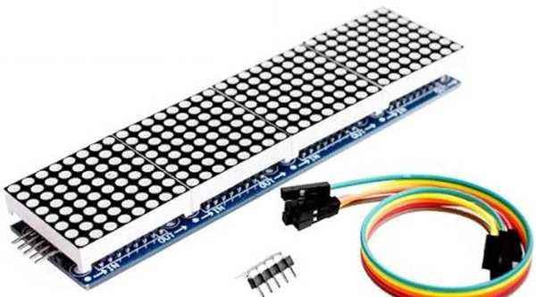

## Взаимодействие с внешним кодом (API библиотеки)

- [Необходимый минимум](#необходимый-минимум)
- [Экран](#экран)
  - [Текущий режим экрана](#текущий-режим-экрана)
  - [Матрица на драйверах MAX7219/7221](#матрица-на-драйверах-max72197221)
  - [Матрица на адресных светодиодах](#матрица-на-адресных-светодиодах)
  - [Экран LCD 1602/2004](#экран-lcd-16022004)
  - [Пользовательские режимы экрана](#пользовательские-режимы-экрана)
    - [Кнопки в пользовательском режиме](#кнопки-в-пользовательском-режиме)
- [Текущие настройки часов](#текущие-настройки-часов)
  - [Время и дата](#время-и-дата)
  - [Температура](#температура)
  - [Будильник](#будильник)
  - [Анимация](#анимация)
  - [Автовывод даты и/или температуры](#автовывод-даты-иили-температуры)
  - [Секундный столбик](#секундный-столбик)
  - [Порог переключения яркости](#порог-переключения-яркости)
  - [Регулировка уровней яркости экрана](#регулировка-уровней-яркости-экрана)
- [Кнопки](#кнопки)
  - [Дополнительные кнопки](#дополнительные-кнопки)
- [События](#события)
  - [Ежесекундное событие](#ежесекундное-событие)
  - [Событие будильника](#событие-будильника)
- [Разрядность АЦП микроконтроллера](#разрядность-ацп-микроконтроллера)
- [Прочее](#прочее)
- [Смотри так же](#смотри-так-же)

### Необходимый минимум

Библиотека **shSimpleClock** позволяет легко и быстро создавать электронные часы без написания дополнительного кода. Простейший скетч часов выглядит так:
```
#include "clockSetting.h"
#include <shSimpleClock.h>

// объявляем экземпляр часов
shSimpleClock simple_clock;

void setup()
{
  // инициализируем часы
  simple_clock.init();
}

void loop()
{
  // обработка событий часов
  simple_clock.tick();

}
```
Для контроллеров **ESP2866**, **ESP32**, **RP2040** есть возможность устанавливать размер используемой `EEPROM` (в байтах):
```
simple_clock.init(2048);
```
максимально возможный размер `EEPROM` - `4096` байт (по умолчанию используется `256` байт); возможность доступна, если используется хотя бы одна опция, требующая сохранения параметров;

Этого достаточно для создания часов с любым набором опций и поддерживаемой периферии (датчики, экраны, кнопки). Все настройки часов описываются в файле [**clockSetting.h**](clock_setting.md), который должен лежать рядом с файлом скетча. Часы абсолютно самодостаточны и не требуют вмешательства в их работу, вы можете совершенно спокойно писать код своей программы в скетче, не обращая внимания на код часов. Однако, если вам все-таки нужно взаимодействовать с часами - получать текущее время, обрабатывать события кнопок и т.д., и т.п., библиотека предоставляет вам все необходимые для этого инструменты.


### Экран

#### Текущий режим экрана

Метод
```
clkDisplayMode getDisplayMode();
```
позволяет получать текущий режим работы экрана, а метод
```
void setDisplayMode(clkDisplayMode _mode);
```
позволяет установить другой режим. 

Например, код
```
simple_clock.setDisplayMode(DISPLAY_MODE_SHOW_TEMP);
```
на пару секунд выведет на экран часов текущую температуру (если эта опция используется).

***Важно!!!** - таким же образом можно переводить часы в режимы настроек (времени, будильника и т.д., и т.п.), однако изменять настраиваемые опции все равно придется кнопками (или программно устанавливать соответствующие флаги соответствующим кнопкам, [см. здесь](#кнопки-в-пользовательском-режиме)). Так же все эти параметры можно настраивать программно, не вызывая интерфейсы настроек на экран ([см. здесь](#текущие-настройки-часов)).*


#### Матрица на драйверах MAX7219/7221

Для светодиодных матриц, построенных на драйверах **MAX7219**/**MAX7221** могут пригодиться следующие методы:
```
void setMatrixDirection(uint8_t _dir);
```
поворот изображения, параметр `_dir` может принимать значения **1..3**.
```
void setMatrixFlipMode(bool _mode);
```
зеркальное отражение по горизонтали (построчно). 

Дело в том, что, если вы используете готовые китайские матрицы на четыре модуля 8х8, например, такие



то скорее всего столкнетесь с проблемой, когда изображение, вместо того, чтобы располагаться вдоль матрицы, разбивается на четыре части, повернутые на 90 градусов, а то и зеркально отраженные. В этом случае приведенные выше методы позволяют привести ориентацию изображения в норму.

Кроме того, задать нужные поворот и отражение можно в файле [**clockSetting.h**](clock_setting.md).

#### Матрица на адресных светодиодах

Для матриц, основанных на адресных светодиодах доступны дополнительные методы:
```
void setColorOfNumber(CRGB _color);
CRGB getColorOfNumber();
```
позволяют устанавливать и получать текущий цвет символов соответственно.

Методы
```
void setColorOfBackground(CRGB _color);
CRGB getColorOfBackground();
```
позволяют установить и получить текущий цвет фона соответственно; 

Метод
```
void setMaxPSP(uint8_t volts, uint32_t milliamps);
```
позволяет установить параметры блока питания - напряжение (обычно 5v) и максимальную силу тока, которую может отдать блок питания (в милиамперах). Это позволит уберечь блок питания от перегрузки и выхода из строя.


#### Экран LCD 1602/2004

Метод
```
void setBacklightState(bool _state);
```
позволяет включать и выключать подстветку экрана.

Метод
```
void printTextForScreen(uint8_t _col, uint8_t _line, char *_str)
```
позволяет выводить произвольный текст в произвольном месте экрана; здесь `_col` - позиция первого символа строки , `_line` - строка для вывода текста , `_str` - собственно, текст для вывода;

Нужно понимать, что выводить текст имеет смысл либо предварительно задав пользовательский режим экрана (см. ниже), либо в строках, не используемых библиотекой для вывода данных часов (для четырехстрочных экранов).


#### Пользовательские режимы экрана

Для того, чтобы пользователь имел возможность выводить на экран часов свою информацию, в библиотеке предусмотрены четыре пользовательских режима
```
  DISPLAY_MODE_CUSTOM_1,
  DISPLAY_MODE_CUSTOM_2,
  DISPLAY_MODE_CUSTOM_3,
  DISPLAY_MODE_CUSTOM_4
```
Если установить любой из них, например
```
simple_clock.setDisplayMode(DISPLAY_MODE_CUSTOM_1);
```
то вывод на экран будет полностью зависеть от пользователя. 

Для работы с экраном используется объект `clkDisplay`. Основные методы объекта:

```
void clear(); // очистка буфера экрана
void show();  // отрисовка на экране содержимого его буфера
```
***Важно!!!** - метод `show()` использовать необязательно, т.к. он автоматически вызывается каждые 50 милисекунд*

Для вывода данных на семисегментные индикаторы используется метод:
```
void setDispData(uint8_t _index, uint8_t _data);
```
где `_index` - индекс символа на экране, допустимые значения - **0..3**; `_data` - битовая маска символа; для разных драйверов семисегментных индикаторов эти маски могут различаться; для получения битовых масок стандартных HEX-символов (**0..9, A..F**) используется метод
```
uint8_t encodeDigit(uint8_t digit);
```

Метод
```
uint8_t getDispData(uint8_t _index);
```
возвращает битовую маску символа из буфера экрана; `_index` - индекс символа.


Для матричных экранов метод
```
void setDispData(uint8_t offset, uint8_t chr, uint8_t width = 6);
```
так же выводит на экран символ из числа доступных; `offset` - отступ от края экрана, указывает, начиная с какого столбца экрана выводится символ; `chr` - индекс символа для записи; `width` - ширина символа, определяет, какой набор символов будет использован: 5х7 (для текста) или 6х8 (для вывода цифр);  при `width == 6` символы берутся из массива `font_digit[]` (размер символов - 6х8 пикселей), при `width == 5` символы берутся из массива `font_5_7[]` (размер символов - 5х7 пикселей); оба массива расположены в файле **clkMatrix_data.h**

Для вывода данных на матричные экраны кроме того можно использовать метод:
```
void setColumn(uint8_t col, uint8_t _data)
```
метод выводит на экран один столбец; здесь `col` - это индекс столбца (**0..31**), `_data` - битовая маска столбца;

```
uint8_t getColumn(uint8_t col)
```
возвращает битовую маску стобца из буфера экрана; `_index` - индекс символа.

В случае необходимости можно использовать функцию `uint8_t reverseByte(uint8_t b)`, которая меняет порядок следования бит в байте на обратную;


##### Кнопки в пользовательском режиме

Кнопки управления часами в пользовательских режимах функционируют точно так же, как и в стандартных. Одиночный клик кнопками устанавливает этим кнопкам флаг `CLK_BTN_FLAG_NEXT`, который обычно используется для изменения настраиваемого параметра, такой же флаг устанавливается при длительном удержании кнопок **Up** и **Down**.
При длительном удержании кнопки **Set** ей устанавливается флаг `CLK_BTN_FLAG_EXIT`, который обычно используется для выхода в режим отображения текущего времени.

Считывать текущее положение кнопок можно методом
```
clkButtonFlag getButtonFlag(clkButtonType _btn, bool _clear = false);
```
где `btn` - идентификатор кнопки, может принимать значения `CLK_BTN_SET`, `CLK_BTN_UP`, `CLK_BTN_DOWN`; `_clear` - если **true**, то флаг кнопки после считывания будет очищен (установлено значение `CLK_BTN_FLAG_NONE`).

Образец работы с пользовательскими экранами можно посмотреть в [примерах](../examples/other_examples/custom_screen/custom_screen.ino).


### Текущие настройки часов

#### Время и дата

Метод
```
clkDateTime getCurrentDateTime();
```
позволяет получить текущие дату и время. 

Методы
```
void setCurrentTime(uint8_t _hour, uint8_t _minute, uint8_t _second);
void setCurrentDate(uint8_t _date, uint8_t _month);
void setCurrentYear(uint8_t _year);
```
позволяют установить текущие время, дату месяца и год соответственно. Последние два метода доступны, если используется опция `USE_CALENDAR`.

#### Температура

Метод
```
int8_t getTemperature();
```
позволяет получить текущую температуру с используемого датчика. Температура возвращается в целых градусах. Метод доступен, если используется опция `USE_TEMP_DATA`.

#### Будильник

Методы работы с будильником доступны при использовании опции `USE_ALARM`.

Методы
```
uint16_t getAlarmPoint();
void setAlarmPoint(uint16_t _point);
void setAlarmPoint(uint8_t _hour, uint8_t _minute);
```
позволяют получить и установить время срабатывания будильника. В первых двух методах время задается количеством минут от начала суток (`_point = hour * 60 + minute`), в третьем - в более привычном виде.

Методы
```
bool getOnOffAlarm();
void setOnOffAlarm(bool _state);
```
позволяют узнать, включен или нет будильник, и включить/отключить его соответственно.

Метод
```
clkAlarmState getAlarmState()
```
получает текущий статус будильника, что позволяет отслеживать срабатывание; возвращает 
- **ALARM_OFF (0)** - будильник выключен, 
- **ALARM_ON (1)** - будильник включен, 
- **ALARM_YES (2)** - будильник сработал;

Метод
```
void buzzerStop();
```
отключает сигнал сработавшего будильника и устанавливает ему статус **ALARM_ON**.


#### Анимация

Метод
```
void setAnimationState(bool _state);
```
позволяет включать и отключать анимацию вывода информации на экран. 

Метод
```
bool getAnimationState();
```
возвращает текущее состояние опции.

Методы доступны для матричных экранов при использовании опции `USE_TICKER_FOR_DATA`


#### Автовывод даты и/или температуры

Метод
```
void setIntervalForAutoShowData(uint8_t _index);
```
позволяет настроить интервал автоматического вывода даты и/или температуры на экран.

Аргумент `_index` задается в пределах 0..7 в соответствие с таблицей:
```
  _index:  0  1  2  3  4  5  6  7
   время:  0  1  5 10 15 20 30 60 минут
```

Т.е. код
```
simple_clock.setIntervalForAutoShowData(2);
```
задаст интервал автовывода в 5 минут; если установить 0, автовывод будет отключен.

Метод
```
uint8_t getIntervalForAutoShowData();
```
возвращает индекс текущего значения интервала автовывода информации; преобразовать индекс в реальный интервал позволяет функция
```
uint8_t sscGetPeriodForAutoShow(uint8_t index);
```

Методы доступны для матричных экранов при использовании хотя бы одной из опций `USE_CALENDAR` или `USE_TEMP_DATA`.

#### Секундный столбик

Методы 
```
bool getSecondColumnState();
void setSecondColumnState(bool _state);
```
Позволяют получить и установить текущий статус секундного столбика - включено отображение или нет.

Методы доступны для матричных экранов при использовании опции `SHOW_SECOND_COLUMN`.


#### Порог переключения яркости

Методы
```
uint8_t getLightThresholdValue();
void setLightThresholdValue(uint8_t _data);
```
позволяет получить текущий или установить новый порог переключения яркости, допустимый диапазон: 1..9. 

Методы доступны при использовании опции `USE_LIGHT_SENSOR`; не доступны для **LCD 1602/2004** экранов.

***Важно!!!** - для правильной работы этих методов должна быть установлена правильная разрядность АЦП микроконтроллера. По умолчанию используется 10-битное разрешение, как у большинства МК **Atmega**, указать другое разрешение позволяет соответствующий [метод](#разрядность-ацп-микроконтроллераазряд).*


#### Регулировка уровней яркости экрана

Методы
```
uint8_t getBrightnessMax();
void setBrightnessMax(uint8_t _br);
uint8_t getBrightnessMin();
void setBrightnessMin(uint8_t _br);
```
позволяют получить и установить максимальную и минимальную яркости экрана. Последние два метода доступны только при использовании [датчика освещенности](light_sensor.md). Для экранов на основе драйвера **TM1637** яркость (`_br`) может задавать в интервале **1..7**, для экранов на основе драйвера **MAX7219**/**MAX7221** - **0..15**, для матриц на основе адресных светодиодов - **1..25**.

Методы не доступны для **LCD 1602/2004** экранов.


### Кнопки

Для работы с кнопками предусмотрены несколько методов:
```
uint8_t getButtonState(clkButtonType _btn);
```
возвращает текущее состояние или событие кнопки `_btn` по результатам последнего опроса кнопок; возвращаемые данные соответствуют состояниям и событиям кнопки, используемым в библиотеке [**shButton**](https://github.com/VAleSh-Soft/shButton);

```
void resetButtonState(clkButtonType _btn)
```
сбрасывает текущее состояние кнопки `_btn`, обнуляет внутренние счетчики и флаг кнопки; это может быть полезно, если нужно исключить, например, наступление события двойного клика, когда оно нежелательно.

```
bool isButtonClosed(clkButtonType _btn)
```
возвращает **true**, если по результатам последнего опроса кнопка `_btn` нажата.

```
clkButtonFlag getButtonFlag(clkButtonType _btn, bool _clear = false);
void setButtonFlag(clkButtonType _btn, clkButtonFlag _flag);
```
позволяют соответственно получить и установить текущие флаги кнопок `_btn`; 

Если параметр `_clear` в методе `getButtonFlag()` задать равным **true**, то флаг кнопки после считывания будет очищен (установлено значение **CLK_BTN_FLAG_NONE**);

Параметры `_btn` могут принимать следующие значения:
 - **CLK_BTN_SET (0)** - кнопка **Set**;
 - **CLK_BTN_UP (1)** - кнопка **Up**;
 - **CLK_BTN_DOWN (2)** - кнопка **Down**;

флаги кнопок могут принимать следующие значения:
 - **CLK_BTN_FLAG_NONE (0)** - флаг кнопки - ничего не делать;
 - **CLK_BTN_FLAG_NEXT (1)** - флаг кнопки - изменить значение;
 - **CLK_BTN_FLAG_EXIT (2)** - флаг кнопки - возврат в режим показа текущего времени;

Флаги используются для работы с интерфейсами настроек - времени, даты, будильника и всех доступных опций.

***Важно!!!** - все методы работают только при условии, что кнопка используется физически; если для нее задан номер пина -1, то и код для взаимодействия с ней не будет сгенерирован при компиляции прошивки.*

#### Дополнительные кнопки

Кнопки **Add1** и **Add2** по умолчанию используют те же настройки, что и кнопка **Set**, однако для них есть возможноть задать параметры настройки, отличные от таковых для стандартных кнопок, как то - тип контактов кнопки (нормально замкнутые или нормально разомкнутые), тип подключения (с подтяжкой к **GND** или **VCC**), временные интервалы для антидребезга и двойного клика, включать/выключать режим выдачи события `BTN_LONGCLICK` однократно или через равные интервалы, настраивать временные параметры удержания кнопки нажатой. 

Для этого используются следующие методы:

```
void setAddButtonType(clkButtonType _btn, uint8_t _btn_type);
  ```
устанавливает тип кнопки `_btn`; здесь:
- `_btn_type` - тип кнопки; возможные варианты:
    `BTN_NO (0)` - кнопка с нормально разомкнутыми контактами
    `BTN_NC (1)` - кнопка с нормально замкнутыми контактами

```
void setAddButtonInputType(clkButtonType _btn, uint8_t _btn_input_type);
```
устанавливает тип подключения кнопки `_btn`; здесь:
- `_btn_input_type` - тип подключения кнопки; возможные варианты:
    `PULL_UP (0)` - кнопка подтянута к VCC;
    `PULL_DOWN (1)` - кнопка подтянута к GND;

```
  void setAddButtonTimeoutSet(clkButtonType _btn,
                              uint8_t _timeout_of_debounce,
                              uint8_t _timeout_of_dblclick = TIMEOUT_OF_DBLCLICK);
```
выставляет временные интервалы кнопки `_btn`; здесь:
- `_timeout_of_debounce` - интервал антидребезга, мс;
- `_timeout_of_dblclick` - интервал двойного клика, мс;

```
  void setAddButtonLongClickSet(clkButtonType _btn,
                                bool _serial_on,
                                uint8_t _timeout_of_longclick = TIMEOUT_OF_LONGCLICK,
                                uint8_t _interval_of_serial = INTERVAL_OF_SERIAL);
```
настраивает параметры удержания кнопки нажатой`_btn`; здесь:
- `_serial_on` - включение/выключение режима выдачи события BTN_LONGCLICK через заданные интервалы времени после окончания времени удержания кнопки нажатой;
- `_timeout_of_longclick` - время удержания кнопки нажатой до выдачи события BTN_LONGCLICK, мс;
- `_interval_of_serial` - интервал выдачи событий BTN_LONGCLICK при удержании кнопки нажатой при `_serial_on = true`, мс; задавать значение, кратное 50;

***Важно!!!** - для кнопок **Set**, **Up** и **Down** эти методы неприменимы.*


### События

Методы для работы с событиями часов доступны при использовании опции `USE_CLOCK_EVENT`.

#### Ежесекундное событие

Библиотека позволяет задавать callback-функции на ежесекундное событие и событие будильника. Ежесекундное событие, как следует из его названия, происходит каждый раз при смене секунды. К нему относятся методы:
```
void setClockEvent(uint16_t _interval, clkEventCallback _callback, bool _active = true);
```
задает функцию `_callback`, которая будет вызываться через каждые `_interval` секунд, если `_active == true`.


```
void setClockEventState(bool _state);
void getClockEventState();
```
задает и возвращают текущий статус события соответственно - при `_state = false` callback-функция вызываться не будет.


#### Событие будильника

Событие будильника происходит каждый раз при его срабатывании. К нему относятся методы:
```
void setAlarmEvent(clkEventCallback _callback, bool _active = true);
```
задает функцию `_callback`, которая будет вызываться при срабатывании будильника, если `_active == true`.


```
void setAlarmEventState(bool _state);
bool getAlarmEventState();
```
задает и возвращает текущий статус события соответственно - при `_state = false` callback-функция вызываться не будет.

Образец использования событий [см. в примерах](../examples/other_examples/clock_event/clock_event.ino).


### Разрядность АЦП микроконтроллера

АЦП используется часами для определения уровня освещенности и/или температуры (при использовании NTC-термистора в качестве датчика). По умолчанию задана 10-битная разрядность, как в большинстве микроконтроллерах **Atmega/Attiny**, однако в других МК АЦП может иметь другую разрядность. 

Метод:
```
void setADCbitDepth(uint8_t bit_depth);
```
позволяет установить нужную разрядность.

Метод доступен при использовании хотя бы одной из опций `USE_LIGHT_SENSOR` (только если не используется текстовый экран **LCD 1602/2004**) или `USE_NTC`.


### Диспетчер задач

Диспетчер задач библиотеки позволяет добавлять в свой список пользовательские задачи, и они будут обрабатываться наравне с системными задачами часов. У пользователя есть возможность управления своими задачами - запуск, остановка, получение статуса и изменение интервала выполнения. Для этого используются следующие методы:
```
void setAdditionalTaskCount(uint8_t _add_task);
```
увеличение списка задач на величину `_add_task` для добавления дополнительных пользовательских задач в список диспетчера; метод должен вызываться ПЕРЕД вызовом метода `init()`.

```
clkHandle addAdditionalTask(unsigned long _interval,
                            clkTaskManagerCallback _callback,
                            bool isActive = true);
```
добавление пользовательской задачи в список диспетчера задач; метод должен вызываться после вызова метода `init()`, т.е. уже после инициализации списка диспетчера задач; здесь:
- `_interval` - интервал срабатывания задачи в милисекундах;
-`_callback` - функция, которая будет вызываться при срабатывании задачи; функция не должна принимать никаких аргументов и не должна возвращать никаких значений;
-`isActive` - активна ли задача с момента добавления или будет запущена потом;

метод возвращает идентификатор (индекс задачи в списке) в случае успешного добавления  ее в список или -1 в случае неудачи.

```
void startAdditionalTask(clkHandle _handle);
```
запуск пользовательской задачи с идентификатором `_handle`;

```
void stopAdditionalTask(clkHandle _handle);
```
остановка пользовательской задачи с идентификатором `_handle`;

```
bool getAdditionalTaskState(clkHandle _handle);
```
получение статуса пользовательской задачи с идентификатором `_handle`; возвращает **true**, если задача активна (выполняется) или false, если задача неактивна (остановлена) или не существует;

```
void setAdditionalTaskInterval(clkHandle _handle,
                                 unsigned long _interval,
                                 bool _restart = true);
```
установка нового интервала срабатывания пользовательской задачи; здесь:
- `_handle` - идентификатор задачи;
- `_interval` - новое значение интервала срабатывания задачи;
- `_restart` - перезапускать или нет задачу с новым интервалом;

Пример работы с пользовательскими задачами [см. здесь](../examples/other_examples/additional_task/additional_task.ino)


### Прочее

Метод
```
bool getBlink()
```
выдает текущее состояние блинка часов (в часах он используется для мигания двоеточия или настраиваемых параметорв); может быть полезен, если нужно организовать мигание чего либо с частотой 1 Гц на пользовательских экранах.

<hr>

### Смотри так же
- [Главная страница](../readme.md)
- [Используемые модули RTC](rtc.md)
- [Используемые в часах экраны](displays.md)
- [Управление часами - кнопки](buttons.md)
- Дополнительные опции:
  - [Календарь](calendar.md)
  - [Будильник](alarm.md)
  - [Регулировка уровней яркости экрана](br_adjust.md)
  - [Отображение температуры](show_temp.md)
  - [Опции для матричных экранов](matrix.md)
- Внешние датчики:
  - [Датчик освещенности](light_sensor.md)
  - [Датчики температуры](temp_sensors.md)
- [Описание файла `clockSetting.h`](clock_setting.md)
- [Руководство по настройкам часов](setting.md)
