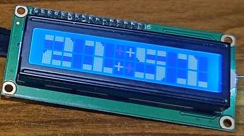

## Используемые экраны

- [Семисегментный индикатор на базе драйвера TM1637](#семисегментный-индикатор-на-базе-драйвера-tm1637)
- [Экраны на базе драйверов MAX7219/MAX7221](#экраны-на-базе-драйверов-max7219max7221)
- [Матрица на адресных светодиодах](#матрица-на-адресных-светодиодах)
- [Текстовый экран LCD 1602/2004](#текстовый-экран-lcd-16022004)
- [Настройки для матричных экранов](#настройки-для-матричных-экранов)
- [Взаимодействие с внешним кодом](#взаимодействие-с-внешним-кодом)
- [Смотри так же](#смотри-так-же)

В часах могут быть использованы либо семисегментый экран на базе драйвера **TM1637**, либо экраны на базе драверов **MAX7219**/**MAX7221**, как в виде семисегментного экрана на четыре цифры, так и светодиодных матриц 8х8 (четыре модуля), либо матрица 8х32, составленная из адресных светодиодов. Кроме того есть возможность использовать текстовые **LCD 1602/2004** экраны, подключаемые подключаемых с помощью адаптера **I2C** на базе чипа **PCF8574**.

Для выбора требуемого экрана нужно задать соответствующий `#define` в блоке **"экран часов"** в файле **clockSetting.h**. Возможны пять вариантов:
- `#define TM1637_DISPLAY`
- `#define MAX72XX_7SEGMENT_DISPLAY`
- `#define MAX72XX_MATRIX_DISPLAY`
- `#define WS2812_MATRIX_DISPLAY`
- `#define LCD_I2C_DISPLAY     `

### Семисегментный индикатор на базе драйвера TM1637


Собственно, никаких настроек, кроме пинов для подключения, этот драйвер не требует.

### Экраны на базе драйверов MAX7219/MAX7221


Нужно помнить, что с этими драйверами библиотека работает через аппаратный SPI микроконтроллера, поэтому номера пинов должны соответвовать вашему МК. В связи с этим пины для подключения для этих экранов указаны только для информации, в коде они нигде не используются.

### Матрица на адресных светодиодах


Для работы с таким матрицами используется библиотека [**FastLED**](https://github.com/FastLED/FastLED). Поддерживаются все виды чипов, поддерживаемых библиотекой **FastLED**, все настройки чипов матрицы находятся в файле **clockSetting.h**.

Нужный тип указывается в блоке **"матрица из адресных светодиодов"** в строке `#define CHIPSET_WS2812B`; возможные варианты чипсетов указаны в комментарии к строке.

В строке `#define EORDER GRB` указывается порядок следования цветов в чипе; наиболее часто используются **GRB** или **RGB**.

Для адресных светодиодов с четырехпроводной схемой управления раскомментируйте строку `// #define USE_HARDWARE_SPI`, если для управления светодиодами будет использоваться аппаратный SPI вашего микроконтроллера, в этом случае указывать номера пинов для подключения матрицы не нужно, подключайте ее к пинам аппаратного SPI (см. даташиты используемых чипов и используемого МК).

Матрица может быть построена как построчно (`BY_LINE`), так и по столбцам (`BY_COLUMNS`); начальная точка - верхний левый пиксель; нужный порядок указывается в строке `#define MX_TYPE BY_COLUMNS`.

В строке `#define COLOR_OF_NUMBER CRGB::Red` нужно указать желаемый цвет выводимой информации; так же цвет может быть установлен программно или изменен в интерфейсе настроек часов.

В строке `#define COLOR_OF_BACKGROUND CRGB::Black` можно указать желаемый цвет фона матрицы; этот цвет так же может быть установлен программно.

В строке `uint32_t constexpr POWER_SUPPLY_VOLTAGE = 5;` можно указать напряжение блока питания в вольтах; обычно это 5В.

В строке `uint32_t constexpr POWER_SUPPLY_CURRENT = 2000;` нужно указать максимальный ток блока питания в милиамперах, это позволит избежать его перегрузки и выхода из строя; оба параметра можно так же задавать программно.


### Текстовый экран LCD 1602/2004



Информация на экран выводится в две строки, формируя цифры с помощью сгенерированных сегментов. В случае с четырехстрочным экраном есть возможность одновременно выводить текстовую информацию в свободных строках экрана.


Эти экраны работают по **I2C**, поэтому в файле **clockSetting.h** должен быть указан его адрес на шине; обычно это **0x27**, адрес указывается в строке 
```
constexpr uint8_t BUS_DISPLAY_ADDRESS = 0X27;
```

Кроме того для правильной инициализации экрана при запуске нужно указать количество символов на строку и количество строк на экране
```
constexpr uint8_t NUMBER_OF_CHAR_PER_LINE = 16;
constexpr uint8_t NUMBER_OF_LINE_PER_DISPLAY = 2;
```

Номера первой и второй строки для вывода информации
```
constexpr uint8_t FIRST_LINE_NUMBER = 0;
constexpr uint8_t SECOND_LINE_NUMBER = 1;
```

и смещение первого символа от левого края экрана
```
constexpr uint8_t OFFSET_FOR_FIRST_CHAR = 0;
```
Последние три опции имеет смысл менять, если у вас четырехстрочный экран.

Экран должен подлючаться к пинам аппаратного **I2C** вашего МК, поэтому номера пинов указаны только для информации, в коде они нигде не используются;


### Настройки для матричных экранов

Матричные экраны, в отличие от семисегментных индикаторов, позволяют выводить полноценные текстовые символы, поэтому имеют дополнительные настройки, которые собраны в блоке **"опции для матричных экранов"** в файле **clockSetting.h**.

Строка `#define USE_RU_LANGUAGE` указывает, что для вывода дней недели и прочей информации будут использоваться символы кириллицы и русский язык. Если вам это не нужно, закомментируйте эту строку, информация будет выводиться по английски.

Строка `#define USE_TICKER_FOR_DATA` позволяет анимировать вывод информации бегущей строкой. Если закомментировать эту строку, то информация будет просто сменять друг друга.

Строка `#define SHOW_SECOND_COLUMN` включает вывод в крайнем правом столбце экрана столбика светодиодов, отображающих количество прошедших секунд в минуте. Первые полминуты каждые пять секунд светодиодный столбик увеличивается на один светодиод снизу вверх, со второй половины минуты светодиодный столбик каждые пять секунд уменьшается на один светодиод снизу вверх.

### Взаимодействие с внешним кодом

Библиотека позволяет как получить текущий режим монитора, так и установить его. Для этого используются методы:
- `clkDisplayMode getDisplayMode()` - получить текущий режим монитора часов;
- `void setDisplayMode(clkDisplayMode _mode)` - задать режим монитора часов;

Для матричных мониторов на базе драйверов **MAX7219**/**MAX7221** есть возможность управлять повотором или отражением изображения на матрице, чтобы привести картинку на матрице к норме (проблемами с направлением изображения страдают обычно готовые китайские модули, составленные из четырех матриц 8х8). Для этого используются методы:
- `setMatrixDirection(uint8_t _dir)` - поворот изображения на матрице, задается значением 0..3;
- `setMatrixFlipMode(bool _mode)` - включить отражение картинки по горизонтали (по строкам);

Для матричных мониторов на основе адресных светодиодов библиотека позволяет задать цвет как символов, так и фона. Для этого используются методы:
- `setColorOfNumber(CRGB _color)` - установить цвет символов;
- `setColorOfBackground(CRGB _color)` - установить цвет фона;

Получить текущий и задать новый цвет фона позволяют методы:
- `CRGB getColorOfBackground();`
- `void setColorOfBackground(CRGB _color);`

Для ограничения потребляемого матрицей тока можно задать параметры блока питания. Для этого используется метод:
- `void setMaxPSP(uint8_t volts, uint32_t milliamps);` - установить напряжение (В) и максимальный ток блока питания (мА);

Для текстовых экранов **LCD 1602/2004** есть возможность управлять подсветкой экрана (включить/выключить)
```
void setBacklightState(bool _state);
```
А так же выводить произвольный текст на экран (кириллица не поддерживается)
```
void printTextForScreen(uint8_t _col, uint8_t _line, const char *_str);
```
здесь: `_col` - столбец для первого символа текста (смещение от левого края); `_line` - номер строки для вывода текста; `*_str` - указатель на текст для вывода.

<hr>

### Смотри так же
- [Главная страница](../readme.md)
- [Используемые модули RTC](rtc.md)
- [Управление часами - кнопки](buttons.md)
- Дополнительные опции:
  - [Календарь](calendar.md)
  - [Будильник](alarm.md)
  - [Регулировка уровней яркости экрана](br_adjust.md)
  - [Отображение температуры](show_temp.md)
  - [Опции для матричных экранов](matrix.md)
- Внешние датчики:
  - [Датчик освещенности](light_sensor.md)
  - [Датчики температуры](temp_sensors.md)
- [Описание файла `clockSetting.h`](clock_setting.md)
- [Взаимодействие с внешним кодом (API библиотеки)](api.md)
- [Руководство по настройкам часов](setting.md)
