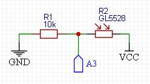

## Датчик освещенности

- [Подключение опции](#подключение-опции)
- [Схема подключения](#схема-подключения)
- [Смотри так же](#смотри-так-же)

### Подключение опции

Для того, чтобы иметь возможность использовать датчик освещенности, нужно раскомментировать строку `#define USE_LIGHT_SENSOR` в блоке **датчики - датчик освещенности** в файле **clockSetting.h**. В результате появляется возможность автоматически снижать яркость экрана при низком освещении.

Аналоговый пин для подключения датчика определяется в строке `#define LIGHT_SENSOR_PIN A3` в том же блоке.

### Схема подключения

Датчик освещенности - фоторезистор типа **GL5528**.

### Смотри так же
- [Главная страница](../readme.md)
- [Используемые модули RTC](rtc.md)
- [Используемые в часах экраны](displays.md)
- [Управление часами - кнопки](buttons.md)
- Дополнительные опции:
  - [Календарь](calendar.md)
  - [Будильник](alarm.md)
  - [Регулировка уровней яркости экрана](br_adjust.md)
  - [Отображение температуры](show_temp.md)
  - [Опции для матричных экранов](matrix.md)
- Внешние датчики:
  - [Датчики температуры](temp_sensors.md)
- [Описание файла `clockSetting.h`](clock_setting.md)
- [Взаимодействие с внешним кодом (API библиотеки)](api.md)
- [Руководство по настройкам часов](setting.md)
