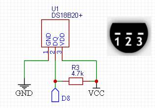
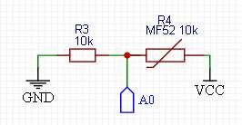

## Датчики температуры

- [Датчик **DS18b20**.](#датчик-ds18b20)
- [NTC термистор.](#ntc-термистор)
- [Смотри так же](#смотри-так-же)

Температура по умолчанию берется из внутреннего датчика микросхемы **DS3231**, однако есть возможность использования внешних датчиков.

### Датчик **DS18b20**. 

Для этого нужно раскомментировать строку `#define USE_DS18B20` в блоке **датчики - DS18B20** в файле **clockSetting.h**.

Схема подключения датчика DS18b20:

Кроме датчика **DS18b20** можно использовать датчики **DS18s20**, **DS1820**, **DS1822**.

Пин для подключения линии данных датчика определяется в строке `int8_t constexpr DS18B20_PIN = 8`.

В случае отсутствия, неисправности или обрыва линии данных датчика на экран будет выводиться строка минусов.

### NTC термистор. 

Для этого нужно раскомментировать строку `#define USE_NTC` в блоке **датчики - NTC термистор** в файле **clockSetting.h**.

Схема подключения датчика:

Для использования термистора нужно знать его сопротивление при комнатной (25 градусов Цельсия) температуре и точное сопротивление резистора R3 (и то, и другое - в омах). Также нужно знать бета-коэффициент термистора - он отражает изменение сопротивления термистора при изменении температуры; значение коэффициента можно узнать у производителя датчика или рассчитать (см. описание в файле **ntc.h**)

Аналоговый пин для подключения датчика определяется в строке `int8_t constexpr NTC_PIN = A0`.

### Смотри так же
- [Главная страница](../readme.md)
- [Используемые модули RTC](rtc.md)
- [Используемые в часах экраны](displays.md)
- [Управление часами - кнопки](buttons.md)
- Дополнительные опции:
  - [Календарь](calendar.md)
  - [Будильник](alarm.md)
  - [Регулировка уровней яркости экрана](br_adjust.md)
  - [Отображение температуры](show_temp.md)
  - [Опции для матричных экранов](matrix.md)
- Внешние датчики:
  - [Датчик освещенности](light_sensor.md)
- [Описание файла `clockSetting.h`](clock_setting.md)
- [Взаимодействие с внешним кодом (API библиотеки)](api.md)
- [Руководство по настройкам часов](setting.md)
